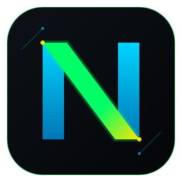

<div align="center">
  
  <h1>Νoia</h1>
  <p><b>A Estação de Trabalho Científica e Minimalista.</b></p>
  <p>
    <a href="https://www.gnu.org/licenses/gpl-3.0">
      
    </a>
  </p>
</div>

O **Noia** traz a simplicidade de volta aos seus textos, mas com o rigor semântico que a ciência exige. Escrita aberta que se adapta ao seu estilo, recuperação rápida de informações e exportação versátil. 

Foque no que importa para você. **Publique, não pereça.**

---

## 🌌 A Filosofia Noia (Fork Manifesto)

O **Noia** (representado pela letra grega Ni - **Ν**) é um *hard-fork* do excelente projeto [Zettlr](https://github.com/Zettlr/Zettlr). Ele nasceu para unir o melhor de quatro mundos em uma única ferramenta voltada para pesquisadores, matemáticos e power-users:

1. **A Fundação (Zettlr):** Herdamos a elegância minimalista, a velocidade do CodeMirror 6, a integração com Pandoc/Zotero e a filosofia *Privacy-First* (arquivos locais).
2. **O Poder Semântico (Obsidian):** Implementação nativa de *Callouts/Admonitions* (estilo Google AI Studio) e uma arquitetura de *Chunking Semântico* que permite a correção ortográfica (LanguageTool) de notas com dezenas de milhares de palavras sem colapsar.
3. **A Estética (Upscayl):** O tema oficial **Cyberpunk Brazil** traz a paleta *Dark Void* com acentos em *Neon Emerald*, *Cyber Gold* e *Electric Blue*, combinados com superfícies *glassmorphic*.
4. **O Rigor Científico (TikZ & TeX):** *(Em desenvolvimento)* Onde outros editores param no KaTeX básico, o Noia visa a integração de renderização de grafos, árvores e diagramas complexos via **TikZJax** (WebAssembly) em tempo real.

---

## ✨ Recursos

### Herança do Zettlr
- **Privacidade em primeiro lugar:** Suas anotações ficam no seu disco local.
- **Citações fáceis:** Integração estreita com Zotero, JabRef, etc.
- **Exportação Acadêmica:** Suporte a modelos LaTeX e Word via Pandoc.
- **Zettelkasten:** Suporte para técnicas modernas de gestão do conhecimento.
- **Pesquisa de texto completo** ultrarrápida.

### Exclusividades Noia
- 🟢 **Tema Cyberpunk Brazil:** UI nativa de alto contraste para longas sessões de escrita.
- 📝 **Callouts Nativos:** Suporte integrado a `> [!note]`, `> [!warning]`, `> [!error]` renderizados diretamente no AST do editor.
- 🧠 **LanguageTool Unbound:** Algoritmo de particionamento de texto que burla o limite de caracteres de APIs de correção.
- 📐 **Advanced Math Engine:** Suporte planejado para renderização de blocos TikZ.

---

## 🛠️ Compilando a Partir do Código Fonte

O Noia é um aplicativo baseado em [Electron](https://www.electronjs.org/). Para começar a desenvolver, você precisará de:

1. **Node.js** (Versão 20+ LTS).
2. **Yarn** (Ativado via `corepack enable`).
3. **Toolchain de Compilação C++:**
   - **Windows:** Visual Studio Build Tools (Desktop development with C++).
   - **macOS:** XCode command-line tools (`xcode-select --install`).
   - **Linux:** `build-essential` ou equivalente.

Clone o repositório e instale as dependências:

```bash
git clone https://github.com/SEU-USUARIO/Noia.git
cd Noia
yarn install
```

Para iniciar o ambiente de desenvolvimento com *Hot Module Reloading* (HMR):
```bash
yarn start
```
*(Nota: No Windows, recomenda-se executar o `yarn start` utilizando o terminal **Git Bash** para evitar erros com scripts Unix).*

---

## 🏗️ Visão Geral da Arquitetura

O Noia herda a arquitetura robusta do Zettlr, dividida entre um processo principal (Main) e processos de renderização (Renderers/SPAs).

- **Main Process (`source/app`):** Funciona como um servidor que orquestra as janelas e faz a ponte com o SO. Contém o `lifecycle.ts`, o `app-service-container.ts` e os *Service Providers* (singletons).
- **Renderer Processes (`source/common/modules`):** SPAs construídas com **Vue.js 3** e **Pinia**. A comunicação com o Main Process é feita via IPC (Electron), injetada por um script de preload.
- **Editor Core:** O coração da edição de texto é o **CodeMirror 6**, estendido com `ViewPlugins` e `DecorationSets` customizados (onde os Callouts do Noia são injetados).

### Comandos de Desenvolvimento

- `yarn start`: Inicia o app em modo de desenvolvimento. Use `yarn start --clean` na primeira vez para gerar o diretório de testes.
- `yarn package`: Empacota o aplicativo (sem instalador) para a plataforma atual.
- `yarn release:{platform-arch}`: Empacota e gera o instalador (ex: `release:win-x64`, `release:mac-arm`).
- `yarn lint`: Roda o ESLint e o verificador de tipos do TypeScript.

### Estrutura de Diretórios Principal

```text
.
├── out/ & release/                       # Binários compilados e instaladores
├── resources/icons/                      # Ícones da marca Noia (Ni - Ν)
├── source/                               # Código-fonte
│   ├── app/                              # Main process (Service Providers, IPC)
│   ├── common/                           # Módulos compartilhados
│   │   ├── modules/markdown-editor/      # CodeMirror 6 (Temas, Renderers, Callouts)
│   │   └── vue/                          # Componentes Vue 3
│   └── win-*/                            # SPAs das janelas (win-main, win-preferences, etc.)
└── static/                               # Arquivos estáticos (CSL, dicionários, defaults)
```

---

## ⚖️ Licença

Este software é licenciado sob a [GNU GPL v3-License](https://www.gnu.org/licenses/gpl-3.0.en.html).

O Noia é um fork independente. A marca original "Zettlr" e seus logotipos (Zeta) pertencem aos seus respectivos criadores e foram substituídos neste repositório pela marca "Noia" (Ni), em estrita conformidade com as diretrizes de uso da licença original.